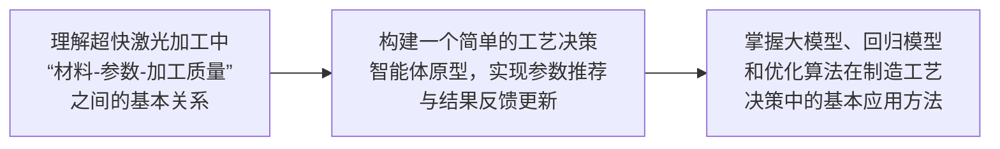

# 项目9：超快激光加工过程的工艺决策智能体

---

## （一）项目背景：激光工艺开发效率低、依赖试错，亟需颠覆传统范式，实现智能规划

### 激光微加工

| 类型 | 示例 |
|---|---|
| 激光划片 | 太阳能电池片等薄片材料的激光划线/划片加工 |
| 激光切割 | 金属板材、结构件等材料的激光切割加工 |
| 激光剥线 | 线缆、薄膜、涂层等材料的选择性去除 |
| 激光钻孔 | 微孔、深孔、高精度孔结构加工 |

### 需求

- 工艺窗口狭窄，参数微小变动导致结果天壤之别，传统“试错法”成本高昂、效率低下。
- 微观尺度的熔融、气化等物理化学过程难以精确描述和预测。
- 在加工高附加值零件时，要求工艺方案具备极高的可靠性和一次性成功率。

### 挑战

- 数据获取难、周期长、成本高。
- 如何让 AI 模型不仅能拟合已知数据，更能准确预测未经验证的新材料、新结构、新要求的加工效果。
- 加工效率、表面质量、几何精度的多目标优化权衡。
- 知识与经验的固化与传承。

---

## （二）项目目标

面向超快激光加工场景，设计一个工艺决策智能体系统，实现从加工任务输入、相似数据检索、参数推荐到实验反馈更新的基本闭环。

### 项目任务

1. 整理已有实验数据，明确材料类型、激光参数和加工质量指标。
2. 设计工艺决策流程，实现“输入加工任务-检索相似数据-推荐加工参数”的基本功能。
3. 根据实验结果反馈，利用贝叶斯决策等方法对推荐参数进行更新迭代。

---

## （三）研究内容

### 1. 加工实验数据整理与相似案例检索

对已有高温合金、微晶玻璃、4H 碳化硅和 BF33 的实验数据进行整理，形成统一的数据表。

根据用户输入的材料类型和加工目标，检索相似历史实验数据，为参数推荐提供参考。

### 2. 参数推荐模型设计

基于历史数据，利用回归模型分析激光参数与加工质量之间的关系，给出满足加工目标的参数推荐结果，如功率、频率、扫描速度等。

### 3. 反馈更新与智能体界面实现

将实际加工结果重新写入系统，利用简单的贝叶斯优化或迭代更新方法改进参数推荐效果。

同时设计一个简单交互界面，实现任务输入、推荐结果展示和反馈录入。

---

## （四）研究条件

- 已具备多种材料的超快激光打孔实验数据。
- 数据中包含激光器参数及对应加工质量测试结果。
- 具备好数据和差数据，可用于参数推荐与效果对比分析。
- 可使用 Python、数据分析库和简单界面开发工具完成实现。

### 最优工艺参数

| 类型 | 脉冲宽度 | 脉冲频率 | 脉冲能量 | 离焦量 | 标刻次数 |
|---|---:|---:|---:|---:|---:|
| 最优工艺参数 | 240 | 260 | 0.3 | 0.7 | 348 |

### 加工实践流程

### 加工质量实测值

| 类型 | 深度 | 直径 | 表面粗糙度 |
|---|---:|---:|---:|
| 加工质量实测值 | 41.091 | 500.480 | 8.122 |

---

## （五）成果要求与能力提升

| 每组提交 | 通过本项目，学生能够 |
|---|---|
| - 项目程序或原型系统 - 数据整理结果与参数推荐说明 - 测试案例及结果分析 - 项目报告及 PPT 汇报 | - 理解超快激光加工中的基本工艺决策问题 - 学会利用实验数据进行参数分析与推荐 - 掌握回归模型、优化方法和智能体系统的基本实现思路 - 提升面向制造场景的数据分析、系统设计与综合实践能力 |
