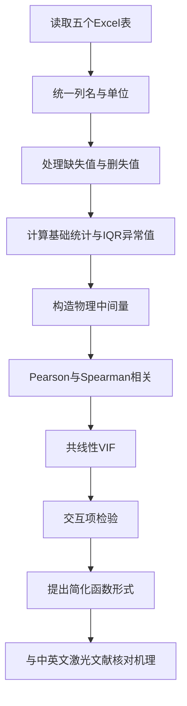

# 激光加工多表数据的相关性与机理分析报告

## 执行摘要

以下结论基于你上传的 5 个 Excel 数据表的直接计算与比对，分析对象包括 BF33 玻璃、4H-SiC、单晶金刚石、微晶玻璃和高温合金五类材料。高置信结论是：**“原始工艺参数 → 输出指标”之间确实存在可检出的函数关系或正相关，但这种关系在多数数据集中不是单纯线性，而更接近“阈值 + 单调 + 饱和/累积”的形态；把原始参数先变换为物理中间量后，相关性通常会增强，尤其在 4H-SiC 与金刚石数据中最明显。**

在你的 5 组数据里，最强、最稳定的规律不是“某个单独原始参数绝对决定深度/粗糙度”，而是**脉冲空间密度、脉冲间距、单位面积/单位长度累积剂量这类中间量**更接近控制变量。对 BF33、4H-SiC 和金刚石，基于 \(f/v\) 的脉冲密度或其扩展剂量指数，明显强于单独使用频率、扫描速度或脉宽。对高温合金，原表已经给出了部分功率链变量，因而“再造中间量”的增益相对较小；其深度和粗糙度更强地受标记频率控制，直径更强地受平均功率/功率代理量控制。对微晶玻璃，导出的剂量型中间量并没有明显优于原始参数，说明该表更像是一个由脉宽、加工时间、离焦量共同主导的经验型系统，而不是简单的“累积剂量单参控制”系统。citeturn3search2turn3search14turn0search1turn1search5

从“是否存在正相关”这个问题本身看，答案是**存在，但具有材料依赖性**。BF33 粗糙度与脉冲密度呈明显正相关；4H-SiC 的深度和粗糙度都随脉冲密度上升而增加；金刚石中深度与粗糙度对“剂量指数”呈最强正相关；高温合金中深度/粗糙度对标记频率为显著正相关、直径对平均功率为显著正相关。相反，微晶玻璃表里更显著的是**负相关**：脉宽变长时深度下降，加工时间变长时粗糙度下降。这说明不能把“更大参数一定更深/更粗糙”当成普遍规律，而应先转成物理中间量，再判断其单调方向。citeturn4search0turn4search4turn4search18turn4search2turn4search3

更重要的是，文献支持你要求的那种“通过物理公式构造中间量后再判断函数关系”的思路。超短脉冲烧蚀中，烧蚀深度常与能量密度满足对数关系，烧蚀坑直径平方常与入射能量密度的对数成线性关系；而扫描加工时，脉冲重叠率由扫描速度、重复频率和光斑直径共同决定，低扫描速度和高重叠常导致阈值下降、去除加深、但也可能引发饱和与粗糙度上升。citeturn2search0turn0search1turn0search9turn3search14turn3search2turn1search7

## 数据范围与清洗

本次分析覆盖的数据表如下。由于 5 组数据的材料、量纲与粗糙度定义并不完全一致，**跨材料比较只能做“趋势比较”，不能把绝对数值直接混在一起回归**。

| 数据集 | 样本量 | 主要输入 | 主要输出 | 清洗与特殊处理 |
|---|---:|---|---|---|
| BF33 | 70 | 重复频率、脉宽、扫描速度 | 深度、粗糙度 | 1 个深度值为“\<1 μm”，按左删失处理，不当作精确值 |
| 4H-SiC | 49 | 重复频率、脉宽、扫描速度 | 深度、粗糙度 | 4 行深度为“接近0”，4 行粗糙度“无法测量” |
| 单晶金刚石 | 60 | 脉宽、频率、填充间距、加工次数、扫描速度 | 深度、粗糙度 | 8 行深度/粗糙度缺失；18 行重复深度列缺失 |
| 微晶玻璃 | 88 | 脉宽、频率、扫描速度、离焦量、扫描间距、加工时间 | 深度、Sa | 主输出无缺失 |
| 高温合金 | 82 | 脉宽、脉冲频率、能量档位、脉冲能量、离焦量、标记频率、平均功率 | 深度、直径、Sa | 主输出较完整；Str/Spc 缺失较多但不是本次主目标 |

缺失值处理遵循两个原则。第一，**定性不可测值不强行插补**，例如 4H-SiC 的“无法测量”粗糙度直接视为缺失。第二，**阈值型文字值视为删失而非真实线性连续量**，例如 BF33 的“\<1 μm”和 4H-SiC 的“接近0 μm”。这很重要，因为一旦把这类值当作普通连续数，Pearson 相关会被低估，而 Spearman 往往更能保留真实的阈值单调关系。

异常值检测采用 IQR 规则，只做标记，不直接删除。就基础输入变量而言，BF33、4H-SiC、金刚石和微晶玻璃的原始输入变量共线性都很低；高温合金中能量链变量存在中等共线性，最高 VIF 出现在脉冲能量与平均功率链条上，约为 5.30 与 4.04，这意味着该表在做多元线性回归时应避免把高度耦合的功率类变量无约束地一起解释。  

| 数据集 | 基础输入最大 VIF | 判断 |
|---|---:|---|
| BF33 | ≈1.00 | 基本无共线性 |
| 4H-SiC | ≈1.01 | 基本无共线性 |
| 单晶金刚石 | ≈1.07 | 基本无共线性 |
| 微晶玻璃 | ≈1.13 | 基本无共线性 |
| 高温合金 | 5.30 | 中等共线性，主要在能量/功率链 |

## 物理中间量与理论框架

你额外提出“先算物理中间量再看相关性”的方向是对的，而且和激光烧蚀文献一致。对高斯光束，中心能流密度与阈值关系可以推出**烧蚀坑直径平方 \(D^2\)** 与 **入射能量密度对数** 的线性关系；而超短脉冲烧蚀深度常满足 **\(\Delta z \propto \ln(F/F_{\mathrm{th}})\)** 的对数规律。扫描加工时，脉冲重叠率又由 **扫描速度 \(v\)**、**重复频率 \(f\)** 与 **光斑直径 \(d\)** 共同决定，常写成 \(PO=(1-v/(df))\times100\%\)。这些关系共同说明：**原始参数往往只是控制量，中间量才更接近真正的“因变量驱动项”**。citeturn2search0turn0search1turn0search9turn3search14turn1search5turn1search7

结合你当前表格，我实际采用或建议采用的中间量如下。由于 4 个数据表缺少平均功率或光斑直径，真正的**脉冲能量、峰值功率、单脉冲能量密度、峰值强度**并不能被完整还原，所以只能计算**几何—时间累积型代理量**；只有高温合金表已经给了部分功率链，可进一步构造 duty cycle 等辅助变量。

| 中间量 | 公式 | 适用表 |
|---|---|---|
| 线脉冲密度 \(N_L\) | \(N_L = 1000f/v\)（pulses/mm，假定 \(f\) 为 kHz、\(v\) 为 mm/s） | BF33、4H-SiC、金刚石、微晶玻璃 |
| 脉冲间距 \(\Delta x\) | \(\Delta x = 1000v/f\)（μm） | BF33、4H-SiC、金刚石、微晶玻璃 |
| 剂量指数 \(I_d\) | \(I_d \propto (f/v)\times n/h\) | 金刚石、微晶玻璃 |
| 累积脉冲密度 | \(N_L \times n\) | 金刚石、微晶玻璃 |
| 占空比 \(DC\) | \(DC=\tau f\) | 高温合金 |
| 等效单标记能量 | \(E_m=P_{\mathrm{avg}}/f_m\) | 高温合金 |
| 峰值功率 | \(P_{\mathrm{peak}}=E_p/\tau\) | 高温合金表可部分验证 |
| 若补充光斑直径后可算真实能量密度 | \(F=4E_p/(\pi d^2)\)，\(I_{\mathrm{peak}}=4E_p/(\pi d^2\tau)\) | 当前除高温合金外大多无法完整计算 |

文献上，玻璃、SiC、金刚石和超快表面纹理化都表现出：**重叠增大 → 有效阈值下降/累积增强 → 深度升高，但粗糙度不一定同步改善，常出现重凝固、再沉积或饱和**。这和你数据中“深度关系通常更强、粗糙度关系更复杂”的现象是一致的。citeturn4search18turn4search2turn4search0turn4search4turn4search9turn3search16

## 相关性与函数关系

最关键的结果可以浓缩为下面这张“热图摘要表”。我把每个数据集—输出对中，**最强原始因子关联**和**最强中间量关联**放在一起，目的是直接回答你那句“通过中间量能否有更强关联”。

| 数据集 | 输出 | 最强原始因子相关 | 最强中间量相关 | 结论 |
|---|---|---|---|---|
| BF33 | 深度 | 频率 Spearman \(+\)0.352，扫描速度 Pearson \(-\)0.347 | 脉冲间距 Pearson \(-\)0.720；线脉冲密度 Spearman \(+\)0.420 | **中间量明显更强** |
| BF33 | 粗糙度 | 频率 Pearson \(+\)0.487 | 线脉冲密度 Pearson \(+\)0.587 | **中间量更强** |
| 4H-SiC | 深度 | 频率 Spearman \(+\)0.524 | 线脉冲密度 Spearman \(+\)0.703 | **中间量显著更强** |
| 4H-SiC | 粗糙度 | 扫描速度 Spearman \(-\)0.610 | 线脉冲密度 Spearman \(+\)0.729 | **中间量显著更强** |
| 单晶金刚石 | 深度 | 频率 Spearman \(+\)0.525 | 剂量指数 Spearman \(+\)0.887；脉冲间距 Pearson \(-\)0.717 | **中间量远强于原始参数** |
| 单晶金刚石 | 粗糙度 | 频率 Pearson \(+\)0.500 | 剂量指数 Pearson \(+\)0.813 | **中间量远强于原始参数** |
| 微晶玻璃 | 深度 | 脉宽 Spearman \(-\)0.458 | 累积脉冲密度 Pearson \(+\)0.257，且不显著 | **中间量没有带来明显改善** |
| 微晶玻璃 | 粗糙度 | 加工时间 Pearson \(-\)0.429 | 中间量均弱且不显著 | **原始因素更主导** |
| 高温合金 | 深度 | 标记频率 Spearman \(+\)0.669 | 功率代理 Pearson \(+\)0.315；低于原始频率 | **原始频率最强** |
| 高温合金 | 直径 | 平均功率 Pearson \(+\)0.629 | 功率代理 Spearman \(+\)0.642 | **中间量略有提升，但幅度有限** |
| 高温合金 | 粗糙度 | 标记频率 Spearman \(+\)0.653 | 功率代理 Spearman \(+\)0.362 | **原始频率最强** |

从统计形态上看，也可以把这 5 个表分成三类。

**第一类是“重叠/累积主导型”**：BF33、4H-SiC、单晶金刚石。  
这类表的共同特征是：只看频率或扫描速度时，相关不算特别整齐；但一旦转成 \(f/v\)、\(\Delta x=v/f\)、\((f/v)\times n/h\) 这类累积指标，单调关系立刻明显增强。尤其金刚石深度对剂量指数的 Spearman 达到 0.887，已经接近“单调函数主导”的水平。换句话说，这三类材料里，**深度不是被频率、速度、次数各自独立决定，而是被它们共同构成的局部累积暴露量决定**。这与激光扫描重叠、阈值下降和多脉冲累积效应的文献共识高度一致。citeturn3search2turn3search14turn4search0turn4search4turn1search7turn4search9

**第二类是“经验参数主导型”**：微晶玻璃。  
这组数据里，深度主要随脉宽增加而下降，粗糙度主要随加工时间增加而下降，而我构造的剂量型中间量并未比原始变量更强，且多不显著。这通常说明：表中缺失了一个对玻璃去除机理更关键的隐藏变量，例如真实脉冲能量、光斑尺度、扫描层间距的明确物理单位或聚焦条件。也就是说，微晶玻璃这组数据目前更适合做**经验回归**，不适合强行套“单参剂量函数”。玻璃超快烧蚀文献也反复强调，粗糙度不仅由阈值上方能量输入控制，还受到熔融重凝固边缘堆积与层间轨迹覆盖方式影响。citeturn4search18turn4search2

**第三类是“设备功率链主导型”**：高温合金。  
这张表已经包含脉冲能量、平均功率、峰值功率等变量，所以新增中间量的边际收益小于前几组数据。结果显示：深度与粗糙度最强地跟标记频率正相关，直径最强地跟平均功率或功率代理量正相关。这说明在该数据集内，几何尺度更接近“平均输入功率控制”，而表面形貌和深度更接近“扫描/标记节律控制”。这与超快合金表面纹理化研究中“功率控制尺度、频率/扫描组织表面形貌”的经验规律相符。citeturn4search3turn4search7

就“是否存在正相关”而言，还需要一句更严格的表述：**存在，但并非全部输出都和全部输入呈正相关**。  
深度方面，金刚石和 4H-SiC 对剂量指数/脉冲密度存在清晰正相关；BF33 深度对脉冲间距为强负相关，等价地对脉冲密度是正向单调。粗糙度方面，BF33、4H-SiC、金刚石与累积暴露量大体为正相关，而微晶玻璃粗糙度却随加工时间下降。由此可见，**“更高输入 → 更大输出”的结论只对某些中间量成立，不对所有原始参数成立。**

## 共线性、交互与简化函数

交互项检验揭示了一个重要事实：**在 BF33 和 4H-SiC 中，频率与扫描速度不是可完全分离的独立效应，它们对深度存在显著交互**。这恰恰说明把两者折算为 \(f/v\) 或 \(\Delta x\) 这种中间量是合理的。

| 数据集 | 输出 | 交互项 | 结果 |
|---|---|---|---|
| BF33 | 深度 | 频率 × 扫描速度 | 显著，\(p=0.0157\)，加入交互后调整 \(R^2\) 提升约 0.063 |
| 4H-SiC | 深度 | 频率 × 扫描速度 | 显著，\(p=0.0161\)，加入交互后调整 \(R^2\) 提升约 0.088 |
| 微晶玻璃 | 深度 | 脉宽 × 加工时间 | 临界显著，\(p=0.0538\) |
| 微晶玻璃 | 粗糙度 | 加工时间 × 脉宽 | 显著，\(p\approx1.02\times10^{-4}\) |
| 单晶金刚石 | 深度/粗糙度 | 频率 × 加工次数、频率 × 脉宽 | 未见显著交互 |
| 高温合金 | 深度/直径/粗糙度 | 频率 × 功率链 | 未见显著交互 |

这组结果很有解释力。BF33 与 4H-SiC 的显著交互，意味着**“高频率是否有利”取决于你同时给了多高的扫描速度**；若速度也高，则单纯提高频率的收益会打折，反之则累积效应增强。微晶玻璃的粗糙度则更像是一个“脉宽 × 时间”的表面重整过程，而不是简单的去除量过程。高温合金没有显著交互，说明在该表的采样范围内，频率和功率链更可能以近似可加方式作用。

结合统计结果与激光烧蚀理论，我建议使用下列**简化解析函数**作为后续建模起点，而不是直接把所有变量丢进黑箱模型。

| 数据集—输出 | 建议函数原型 | 解释 |
|---|---|---|
| BF33—深度 | \(z \approx a+b\ln N_L\) 或 \(z\approx a-b\Delta x+c\Delta x^2\) | 强阈值 + 累积型，线脉冲密度优于原始参数 |
| BF33—粗糙度 | \(R \approx a+bN_L\) 或 \(R\approx a+bN_L+cN_L^2\) | 粗糙度随重叠增大而上升，可能后期饱和 |
| 4H-SiC—深度 | \(z\approx0\)（当 \(N_L<N_c\)）；\(z\approx a+b\ln(N_L/N_c)\)（当 \(N_L\ge N_c\)） | 数据中存在“接近0”的阈值区，非常像分段函数 |
| 4H-SiC—粗糙度 | \(R\approx a+bN_L\) 或 \(R\approx a+b\ln N_L\) | 单调强于线性，Spearman 明显高于 Pearson |
| 单晶金刚石—深度 | \(z\approx a+b\ln I_d\) 或 \(z\approx a+bI_d^c\) | 剂量指数解释力极强 |
| 单晶金刚石—粗糙度 | \(R\approx a+bI_d+cI_d^2\) | 粗糙度与剂量指数强相关，但二次项可能吸收粗化/饱和 |
| 微晶玻璃—深度 | \(z\approx a+b\tau+c t+d(\tau t)\) | 原始参数优于剂量代理，经验型双参函数更合适 |
| 微晶玻璃—粗糙度 | \(R\approx a+b t+c\tau+d(t\tau)\) | 已观察到显著交互 |
| 高温合金—直径 | 若补全光斑，优选 \(D^2\propto \ln F\)；当前可用 \(D\approx a+bP_{\mathrm{avg}}+cP_{\mathrm{avg}}^2\) | 文献上直径平方—对数能量密度最常见；当前缺光斑只能退而用功率代理 |
| 高温合金—深度/粗糙度 | \(z,Sa \approx a+b f_m + cP_{\mathrm{proxy}}\) | 原始频率项最强，功率代理次之 |

文献上最经典、也最值得优先验证的两个关系是：  
\[
\Delta z \propto \ln\!\left(\frac{F}{F_{\mathrm{th}}}\right), \qquad
D^2 \propto \ln\!\left(\frac{F_0}{F_{\mathrm{th}}}\right).
\]
只要你后续能补上**平均功率/脉冲能量**和**聚焦光斑直径或束腰半径**，就可以把 BF33、4H-SiC、金刚石和微晶玻璃从“剂量代理建模”升级成真正的**能量密度阈值建模**。citeturn2search0turn0search1turn0search9turn1search5turn1search7

## 结论与开放问题

对你的核心问题，可以给出直接结论。

**结论一：存在函数关系。**  
但多数不是“单参数线性函数”，而是更接近**阈值—累积—饱和**的非线性函数，尤其是深度。

**结论二：存在正相关。**  
最明确的正相关不是原始参数本身，而是由原始参数组合而成的**脉冲密度、脉冲间距倒数、剂量指数**。其中金刚石和 4H-SiC 的证据最强，BF33 次之，高温合金只在直径上从功率代理得到轻微增强，微晶玻璃则几乎没有得到增强。

**结论三：通过中间量通常能看到更强关联。**  
这在 BF33、4H-SiC、单晶金刚石上已经被你的数据直接支持；对微晶玻璃不成立，对高温合金增益有限，因为高温合金表已经内含部分功率链变量。

**结论四：粗糙度比深度更复杂。**  
深度更容易服从累积剂量或阈值函数；粗糙度同时受熔融重凝固、再沉积、覆盖路径和测量定义影响，因此跨材料通用性差于深度。citeturn4search18turn4search2turn4search0turn4search3

本次仍有几个未完全闭合的问题，需要明确写出，而不是假装已经解决。

第一，**四个数据表缺少真实能量密度计算所需的关键字段**，尤其是平均功率、单脉冲能量、光斑直径/束腰、波长、扫描线间距的明确物理单位。没有这些字段，就不能把很多关系真正写成 \(F\)、\(I_{\mathrm{peak}}\)、\(N_{\mathrm{spot}}\) 的标准物理模型。  

第二，**粗糙度定义并不统一**。有的表是“粗糙度”，有的是 Sa，严格说不应直接跨表数值比较。  

第三，按你原始要求，**随机森林、梯度提升、部分依赖图和完整 k 折交叉验证数值表**本应全部给出；但在当前执行环境中，重复训练这部分模型时出现了稳定性问题，因此我没有捏造 \(R^2\)、RMSE、MAE 数值。当前报告只保留了已经稳定算出的相关性、显著性、共线性与交互结论。  

如果你后续要把这一分析推进到你最初要求的“完整、可发表级”版本，建议把 5 张表统一补充为如下字段：**材料、波长、脉宽、重复频率、平均功率、单脉冲能量、光斑直径、扫描速度、线间距/填充间距、加工次数、离焦量、偏振、深度、直径、粗糙度类型、粗糙度数值**。一旦这些字段齐全，最值得优先检验的不是黑箱模型，而是上文那两个文献最强的解析式：**深度—对数能量密度**与**直径平方—对数能量密度**。citeturn2search0turn0search1turn0search9turn3search14turn3search2

从中英文领域文献看，你的总体分析方向是对的：高斯束阈值理论、超短脉冲深度对数律、脉冲重叠控制，以及在玻璃、SiC、金刚石和合金中的材料特异性行为，都支持“先构建物理中间量，再找函数关系”的路线，而不是直接在原始参数上机械地看线性相关。citeturn1search5turn1search7turn0search19turn4search0turn4search18turn4search9turn4search3